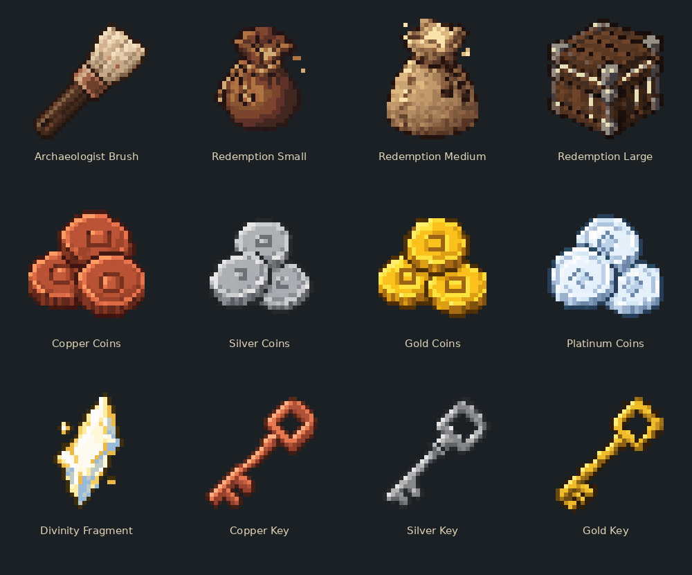

# ArchaeologyPlus — resource packs

Versioned 32×32 resource packs for Minecraft Java 26.2, resource format 88.0.

## Pack 0.5.2-textures.1

[Download the resource pack](ArchaeologyPlus-0.5.2-textures.1-pack.zip)

SHA-1: `8998cf6642883c9050cba44521c3bc7194fc3fcf`

The matching ArchaeologyPlus plugin automatically offers this pack on join. Server owners do not need to open an extra port or configure a pack host. Players must allow server resource packs. The plugin adds its pack without clearing other packs.

Includes an archaeologist brush, three Redemption bundles, copper/silver/gold/platinum coins, a Divinity Fragment, and copper/silver/gold keys. All item textures are exactly 32×32 pixels with transparent backgrounds and shallow 2.5D geometry. Bundles have thicker relief. Light is painted into the texture; these items do not illuminate nearby blocks.

## Hosting

Keep published pack files unchanged. Each plugin build pins an immutable commit URL and SHA-1. New art belongs in a new versioned pack. Clients need HTTPS access to raw.githubusercontent.com.

The artwork began as AI-generated designs and was converted to a limited-colour 32×32 grid. This repository contains the resource assets, not the gameplay plugin.
